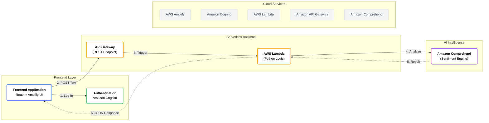

#  Sentilytics Architecture – Detailed Explanation

**Sentilytics** is designed as a modern, event-driven cloud application, built entirely on **AWS Serverless** architecture. It prioritizes low latency, instant scalability, and zero-server management by leveraging the **AWS Amplify** ecosystem and **Amazon AI** services.

---

### **Visual Architecture Diagram**

---

###  Frontend Layer

* **Technologies:** React.js, JavaScript, AWS Amplify UI
* **Responsibilities:**
    * Handles the user interface, including secure Login/Sign-up forms and the sentiment analysis dashboard.
    * Manages client-side state for real-time visual feedback (e.g., changing card colors based on sentiment scores).
    * Communicates asynchronously with the backend API to fetch analysis results without refreshing the page.
* ** External Service: AWS Amplify Hosting**
    * Hosts the static web assets (HTML, CSS, JS) on a global CDN.
    * Provides built-in CI/CD pipelines that automatically deploy changes from the Git repository.
    * Manages SSL certificates and domain mapping automatically.

###  Authentication Layer

* **Technology:** Amazon Cognito
* **Responsibilities:**
    * Provides enterprise-grade security for user sign-ups and sign-ins.
    * Manages Identity Tokens (JWT) to ensure only authorized users can access the analysis API.
    * Handles password recovery and multi-factor authentication flows out of the box.
* ** External Service: Cognito User Pools**
    * Acts as the central directory for all user profiles.
    * Integrates seamlessly with the Amplify Frontend library for a native login experience.

###  Backend Logic Layer

* **Technologies:** AWS Lambda (Python 3.x), Amazon API Gateway
* **Responsibilities:**
    * **API Gateway:** Acts as the secure front door, creating RESTful endpoints (`/analyze`) that accept JSON requests and handle CORS verification.
    * **AWS Lambda:** Executes the core business logic in a serverless environment. It parses the incoming text, sanitizes input, and orchestrates the call to the AI service.
    * **Resilience Logic:** Includes a "Simulation Fallback" mode to ensure the application provides feedback even if AI service quotas or regional locks are active.
* ** External Services:**
    * **Boto3 SDK:** The official AWS SDK for Python, used inside Lambda to communicate securely with Amazon Comprehend.

###  AI Layer

* **Technologies:** Amazon Comprehend (NLP)
* **Responsibilities:**
    * Uses Natural Language Processing (NLP) to analyze raw text.
    * **Sentiment Detection:** Classifies text into four distinct categories: `POSITIVE`, `NEGATIVE`, `NEUTRAL`, or `MIXED`.
    * **Confidence Scoring:** Returns a precise percentage score (e.g., 98% confidence) used to drive the UI visuals.
* ** External Service: AWS AI**
    * A fully managed AI service that scales automatically to handle thousands of requests per second without needing to train custom models.

###  Monitoring & Observability Layer

* **Technology:** Amazon CloudWatch
* **Responsibilities:**
    * Captures detailed execution logs from AWS Lambda for debugging.
    * Monitors API Gateway latency and error rates (e.g., 500 errors).
    * Provides visibility into the application's health and usage patterns.
* ** External Site: AWS Console**
    * Acts as the central dashboard for viewing logs and performance metrics.

---

###  How It All Works Together (End-to-End Flow)

1.  **User Authentication:** The user signs in via the React UI; **Amazon Cognito** verifies credentials and issues a secure session token.
2.  **Input Submission:** The user types text (e.g., "I love this project") and clicks "Analyze".
3.  **API Request:** The frontend sends a secure `POST` request to **Amazon API Gateway**.
4.  **Serverless Trigger:** API Gateway wakes up the **AWS Lambda** function (Python).
5.  **AI Analysis:** Lambda uses the `boto3` library to send the text payload to **Amazon Comprehend**.
6.  **Result Processing:** Comprehend returns the sentiment (e.g., `POSITIVE`) and confidence scores.
7.  **Response:** Lambda formats this data into JSON and returns it to the Frontend.
8.  **Visual Feedback:** The React app receives the data and instantly turns the result card **Green** (for positive) or **Red** (for negative).

---

###  Summary

This architecture makes Sentilytics:

* **Scalable:** AWS Lambda and API Gateway scale from 0 to 10,000+ requests automatically.
* **Cost-Efficient:** Truly serverless; you only pay for the milliseconds the code runs (Pay-per-use).
* **Secure:** Access is protected by Cognito Auth and IAM Roles (Least Privilege Principle).
* **Resilient:** Decoupled architecture ensures that UI failures don't crash the backend, and vice-versa.
